

# Plant Monitoring System using PIC16F18446

The designed application must read data from the sensors, display the status of the environment, and adjust the environment settings in a closed feedback loop. The feedback is represented by the measured soil moisture and bythe air humidity values. To measure these values, a soil moisture sensor and a temperature and humidity sensor are needed. To adjust these environment characteristics levels, devices such as fans and water pumps need to be used. Based on the acquired data, the fans and the pump are operated in order to keep the optimum conditions for the plant to develop.
The firmware puts the PIC® MCU in Sleep mode after completing the mentioned tasks, and it wakes it up every second using a timer interrupt, being also power efficient. By putting the device in Sleep mode, some of the device’s features are turned off decreasing the power consumption, without impacting the application functionalities.

The prototype diagram is presented below.

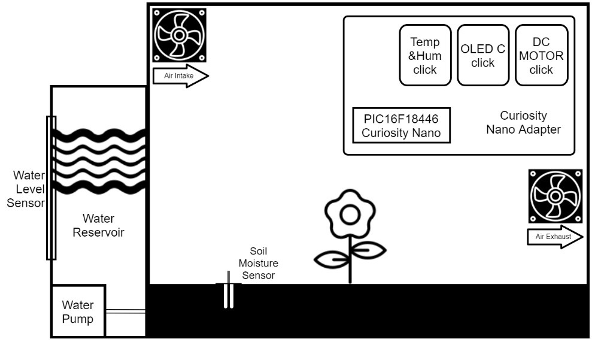 

The components are interconnected according to the diagram presented below. 

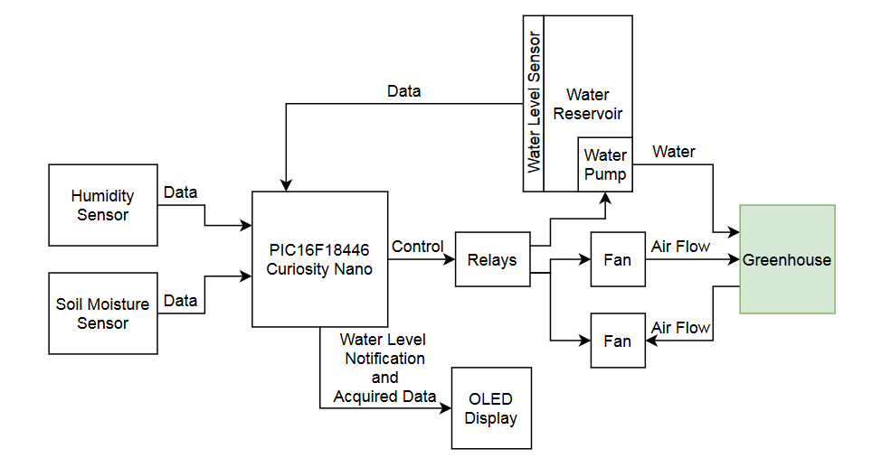 

## Related Documentation

- [PIC16F18446 datasheet](http://ww1.microchip.com/downloads/en/DeviceDoc/40001985B.pdf) for more information or specifications.

## Software Used

- MPLAB® X IDE 5.30 or newer [(microchip.com/mplab/mplab-x-ide)](http://www.microchip.com/mplab/mplab-x-ide)
- MPLAB® XC8 2.10 or newer compiler [(microchip.com/mplab/compilers)](http://www.microchip.com/mplab/compilers)
- MPLAB® Code Configurator (MCC) 3.95.0 or newer [(microchip.com/mplab/mplab-code-configurator)](https://www.microchip.com/mplab/mplab-code-configurator)
- MPLAB® Code Configurator PIC10/PIC12/PIC16/PIC18 library v1.79.0 [(microchip.com/mplab/mplab-code-configurator)](https://www.microchip.com/mplab/mplab-code-configurator)

## Hardware Used

- PIC16F18446 Curiosity Nano [(DM164144)](https://www.microchip.com/DevelopmentTools/ProductDetails/PartNO/DM164144)
- Curiosity Nano Base for Click Boards™ [(AC164162)](https://www.microchip.com/Developmenttools/ProductDetails/AC164162)
- MikroElectronika™ OLED C Click™ [(oled-c-click)](https://www.mikroe.com/oled-c-click)
- MikroElectronika™ RELAY Click™ [(relay-click)](https://www.mikroe.com/relay-click)
- MikroElectronika™ Temp&Hum Click™ [(temp-hum-click)](https://www.mikroe.com/temp-hum-click)

## Setup

The PIC16F18446 Curiosity Nano Development Board is used as the test platform.

 

The AC164162 Curiosity Nano Adapter evaluation kit is a hardware extension that eases the connection between the Curiosity Nano board and extension boards like the mikroBUS™ click boards and Xplained Pro extension boards. The extension board supports three click boards.

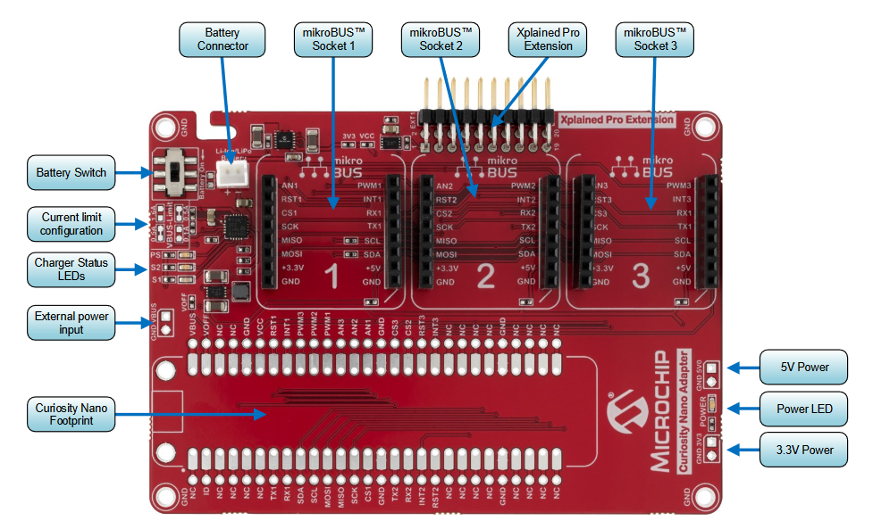 

The software setup is described below.

### Schematic:

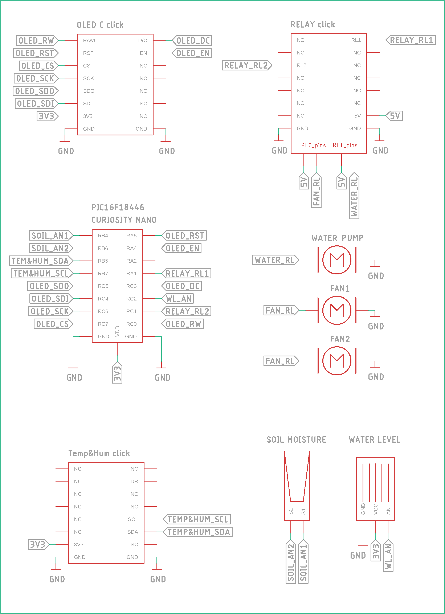 

### Peripherals used:

- MSSP1 (SPI) to display data on OLED C click
- MSSP2 (I2C) to read data from Temp&Hum click
- ADCC to read analog sensors (soil moisture, water level sensor)
- TMR0 to generate interrupt every second

## MCC Settings:

This application uses Foundation Services Libraries and Micro-E Clicks software provided through MCC. The following screenshots illustrate the settings from MCC.

### ADCC:

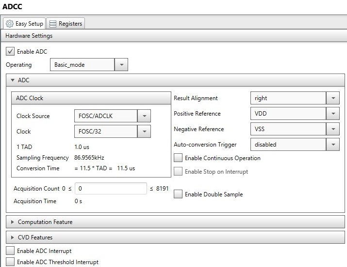 

### MSSP1:

MSSP1 is generated by oledC

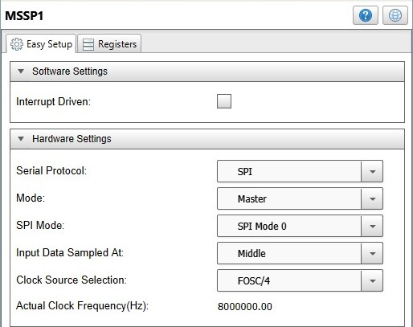 

### MSSP2:

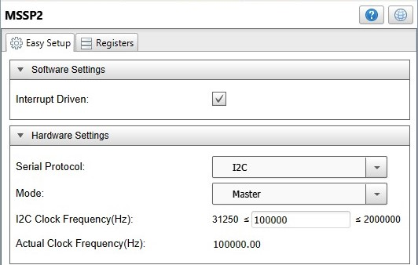 

### TMR0:

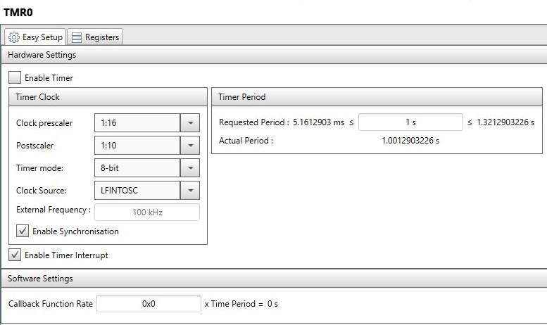 

### MIKROE Clicks - Display - oledC:

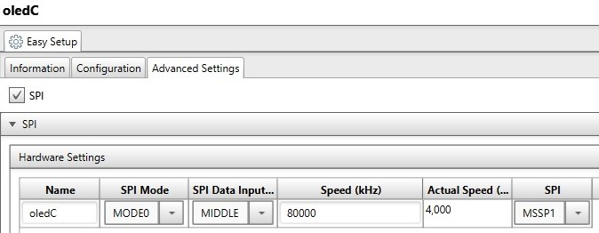 

### Pin Manager:

 

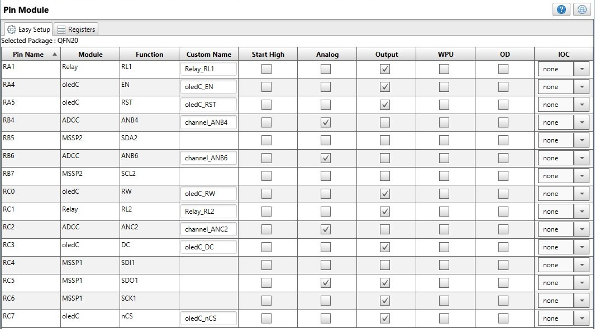 

## Operation

The system starts by initializing the temperature and humidity sensor interface, the OLED display interface and the timer. After the initialization, the following operations are executed in the main loop:

1. Clear the WDT 
- If the WDT is not cleared in less than two seconds, the system is restarted.

2. Read analog and digital sensors 
- Acquire data that describe the environment using the hardware components.

3. Display data from the sensors 
- The acquired data from the sensors are displayed.

4. Adjust the humidity 
- If the humidity value is over 75%, both the intake and the exhaust fans are activated. The greenhouse is ventilated until the humidity drops below 70%.

5. Adjust the soil moisture 
- Every eight hours, data is read using the soil moisture sensor. If the moisture is under 70%, the water pump will be activated for five seconds, which is enough to rehydrate the soil.

6. Reservoir water level indicator 
- If the water level sensor reads a value which is lower than 10%, then a message will display on the OLED C click board until the reservoir will be filled above 70%.

7. Sleep mode 
- The system enters Sleep mode to reduce power consumption. The timer generates an interrupt every second, so the system will wake up and run the loop again.

The humidity, soil moisture and water level values are specific to this application according to the plant and the water reservoir dimensions. These values are configurable and can be changed in the main.c source file by modifying some macro definitions values.

 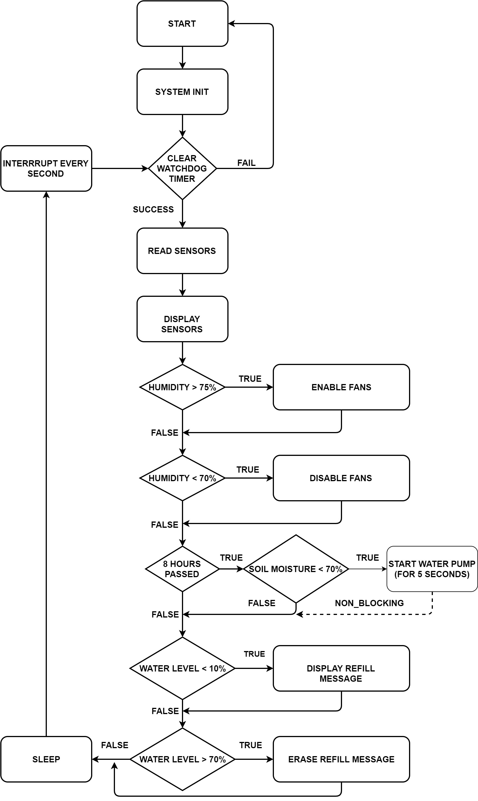

To evaluate this application:

1. Connect the board to the PC.

2. Open the *pic16f18446-cnano-greenhouse.X* project in MPLAB® X IDE.

3. Set *pic16f18446-cnano-greenhouse.X* project as main project. Right click on the project in the *Projects* tab and click *Set as Main Project*:

 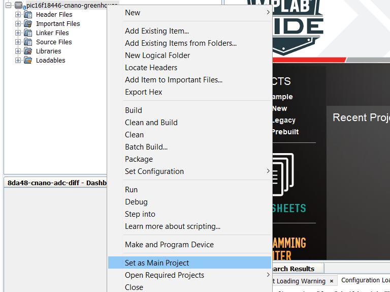

4. Select the *PIC16F18446 Curiosity Nano* in the *Hardware Tool* section of the project settings:
  - Right click on the project and click *Properties*;
  - Select the *PIC16F18446 Curiosity Nano* (click on the SN) in the *Hardware Tool* tab and then click *OK*:

 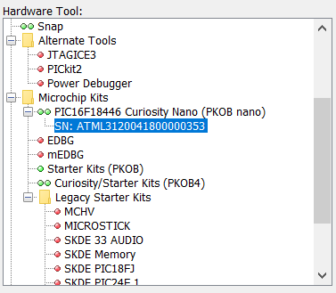

5. Program the project to the board: right click on the project and click *Make and Program Device*:

 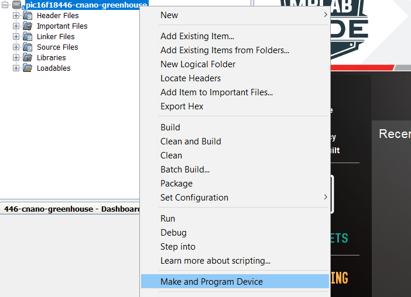

Demo
 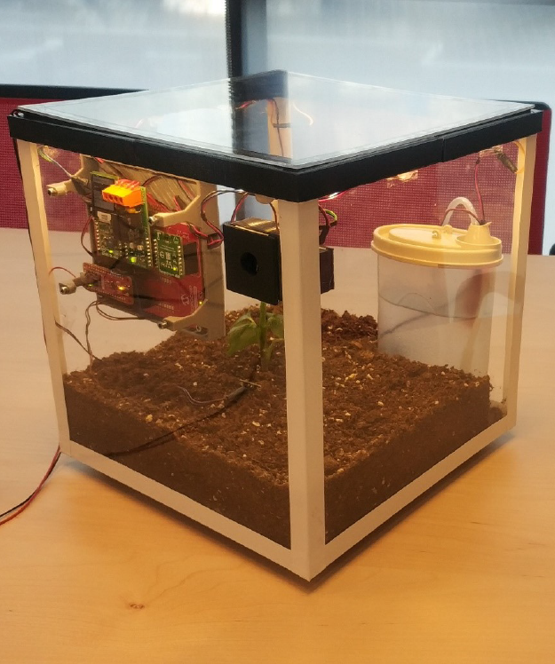

## Summary 

The presented prototype has the purpose to prove the functionality of such a system. The implementation can befurther scaled to develop a larger monitoring system, to automate the control of a real size greenhouse. Significant applications that can start from this prototype belong to the agriculture domain.